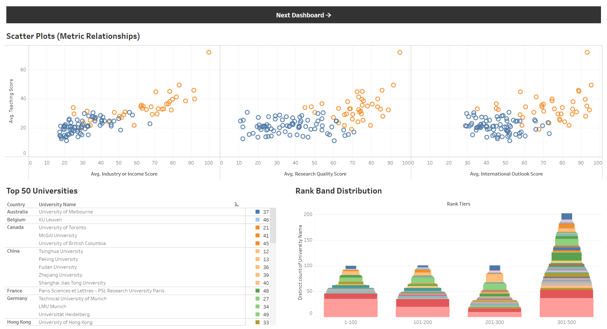
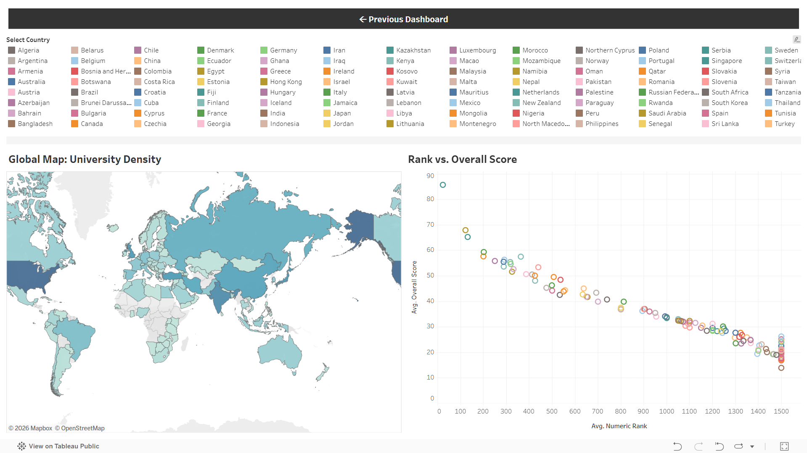

# Global University Rankings Analytics


This thumbnail image was generated using Google's Gemini 2.5 Pro Image (Nano Banana Pro), based on the prompt:

*"Read the following README file and create a thumbnail image of size 3072x864 that visually represents the project. The image should include elements related to data scraping, university rankings, and analytics. Use a modern and clean design style with a color scheme that conveys professionalism and technology."*


## Table of Contents

1. [Overview](#overview)
2. [Tableau Dashboard Preview](#tableau-dashboard-preview)
3. [What this repository contains](#what-this-repository-contains)
4. [Quick Start](#quick-start-windows--powershell)
5. [Script options](#script-options)
6. [Data Preprocessing](#data-preprocessing)
7. [How the scraper works](#how-the-scraper-works-summary)
8. [Debugging & Troubleshooting](#debugging--troubleshooting)
9. [Reproducing the exact run](#reproducing-the-exact-run)
10. [Findings](#findings)
11. [Limitations](#limitations)
12. [Files added](#files-added)
13. [Contact Details](#contact-details)

## Overview

This repository contains a Selenium-based Python scraper that extracts university ranking data from the [THE World University Rankings](https://www.timeshighereducation.com/world-university-rankings/latest/world-ranking). The scraper targets the page's virtualized, scrollable table and performs a deterministic sweep to gather all rows.

### Tableau Dashboard

View the interactive analysis here: [Global University Rankings Analytics Dashboard](https://public.tableau.com/app/profile/mohammad.ashfaq.ur.rahman/viz/GlobalUniversityRankingsAnalytics/GlobalUniversityRankingAnalysis)

### Tableau Dashboard Preview


*The dashboard shows a **positive relationship between research quality and teaching scores**, as universities with higher research scores (around 70–90) generally achieve teaching scores above 30–40. A similar trend appears between **international outlook and teaching**, indicating that globally connected universities often have stronger teaching performance. The **industry income vs teaching plot shows the strongest upward trend**, suggesting that universities with stronger industry partnerships tend to perform better academically. Additionally, the **rank distribution shows most universities fall in the 301–500 tier**, while relatively few institutions reach the top 1–100 ranks, highlighting the competitiveness of elite global universities. The dashboard shows that **Top-50 universities are concentrated in a few countries**, particularly the United States and the United Kingdom, indicating strong dominance in global higher education. The scatter plots also reveal that universities with **higher research quality and stronger international outlook generally achieve higher teaching scores**, suggesting these factors contribute to academic performance. Additionally, the rank distribution indicates that **most universities fall within the 301–500 band**, highlighting how competitive it is to reach the top tiers such as the Top-50.*



*The provided dashboard features a global map of university density and a scatter plot that illustrates a clear **inverse relationship** between average numeric rank and average overall score. The **Global Map: University Density** shows geographical distribution across numerous countries, with darker shading typically indicating higher concentrations of institutions. Meanwhile, the **Rank vs. Overall Score** plot displays a downward trend where universities with the **highest overall scores (near 90)** occupy the top ranks, while scores decrease significantly as the numeric rank approaches 1500.*


## What this repository contains

- `src/scraper.py` — the scraper script. Use the `--help` flag to see runtime options.
- `src/preprocessing.ipynb` - the data preprocessing script.
- `data/the_world_ranking.csv` — example output saved from a recent run (may be overwritten when you run the scraper).
- `data/cleaned_world_ranking.csv` — example output of recent run after data preprocessing.
- `requirements.txt` — Python package requirements for the project.

## Quick Start (Windows / PowerShell)

1. Clone or copy this project to a folder on your machine.
2. (Recommended) Create and activate a virtual environment:

```powershell
python -m venv .venv
.\.venv\Scripts\Activate
```

3. Install required packages:

```powershell
pip install -r requirements.txt
```

4. Install Chrome and download a matching ChromeDriver (or use another WebDriver). Two common options:

- Manually: Download a ChromeDriver that matches your installed Chrome from https://chromedriver.chromium.org/downloads and put the `chromedriver.exe` on your `PATH` (e.g. `C:\Windows\System32` or any folder listed in your PATH).

- Use `webdriver-manager` (optional): install `webdriver-manager` and modify the script to use it. This README assumes `chromedriver.exe` is available on PATH.

5. Run the scraper (non-headless to watch what happens):

```powershell
python .\src\scraper.py --output the_world_ranking.csv
```

To run headless and speed up scraping, set the `--headless` flag:

```powershell
python .\src\scraper.py --headless --min-wait 0.15 --max-wait 0.30 --output the_world_ranking.csv
```

To only test the extraction (don't write CSV):

```powershell
python .\src\scraper.py --dry-run
```

## Script options

Run `python src/scraper.py --help` for details. Key flags used in practice:

- `--output, -o`: CSV output path (default `data/the_world_ranking.csv`).
- `--headless`: Run browser in headless mode.
- `--dry-run`: Do not save CSV (useful for quick checks).
- `--min-wait` / `--max-wait`: Small random wait window between actions to mimic human behaviour and allow lazy loading.
- `--url`: Alternate URL to scrape (default is the THE world ranking page).

## Data Preprocessing

After scraping, the raw data is cleaned and preprocessed using the Jupyter notebook located at `src/preprocessing.ipynb`. This notebook:

- Removes duplicate entries
- Handles missing or null values
- Normalizes column names and formats
- Converts data types (e.g., rankings from string to numeric)
- Filters out incomplete records
- Generates the cleaned output file: `data/cleaned_world_ranking.csv`

## How the scraper works (summary)

- The script locates the first `<table>` element on the page.
- It finds the nearest ancestor element of the table that is scrollable (overflow-y: auto/scroll and scrollHeight > clientHeight).
- The scraper deterministically steps through the container's scrollTop positions (with overlap) and reads the visible `<tr>` elements from the `<tbody>` at each offset.
- Collected rows are deduplicated (keyed on Rank + Name columns) and written to a CSV.

This approach was chosen because THE uses a virtualized table (huge `tbody` heights with absolutely positioned row elements) where page scrolling doesn't reveal the table rows reliably. Scrolling the table container directly allows the site to render the visible rows at that offset.

## Debugging & Troubleshooting

- If you see that the script extracts far fewer rows than expected:

  - Make sure ChromeDriver matches your installed Chrome version.
  - Run without `--headless` to watch the browser; overlays (cookie dialogs) or interstitials might prevent correct rendering or interaction.
  - Increase `--max-wait` to give the site more time to render rows.

- If the site displays cookie-consent modal or accepts geographic checks, you may need to accept or close that overlay manually (or add a handler in `scraper.py` to close it automatically).

- If you get `selenium.common.exceptions.SessionNotCreatedException` or `chromedriver` errors, check that `chromedriver.exe` is on PATH and matches Chrome.

- If you prefer automatic driver management, install `webdriver-manager` and either modify `scraper.py` to use it or install ChromeDriver into PATH using a package manager.

## Reproducing the exact run

Run with the smaller human-wait window used during development and headless mode to speed up scraping while still allowing the site to render properly:

```powershell
python .\src\scraper.py --headless --min-wait 0.12 --max-wait 0.30 --output the_world_ranking.csv
```

Expected outcome: a CSV with ~3,000+ rows (the exact number depends on the live ranking dataset).:


## Findings

- **Singapore appears highly competitive despite its size**, with both National University of Singapore (Rank 17) and Nanyang Technological University (Rank 26) in the Top-50, meaning **100% of its listed universities fall within the elite tier**. 

- **Singapore’s lead is most evident in Research and Industry-related metrics**, where it outperforms every other country by a wide margin. Hong Kong and the Netherlands follow, but the difference remains substantial.

- **Hong Kong ranks as the next strongest performer**, especially in Teaching and Research Quality. However, Singapore still maintains a noticeably higher Teaching score, suggesting a more advanced academic and instructional environment.

- **The United States dominates the Top-50 universities list with 23 institutions**, including Massachusetts Institute of Technology (Rank 1), Harvard University (Rank 3), Stanford University (Rank 2), and Princeton University (Rank 8). This means **nearly half of the Top-50 universities come from one country**. 

- **The United Kingdom has 6 universities in the Top-50**, led by University of Oxford (Rank 4) and University of Cambridge (Rank 5), followed by Imperial College London (Rank 6) and UCL (Rank 9). This places the UK **second globally in representation within the Top-50**. 

- **China has 5 universities in the Top-50**, including Tsinghua University (Rank 12) and Peking University (Rank 13). This indicates **China is the most represented Asian country in the elite group**. 

- **The rank vs overall score chart shows a strong negative relationship**: universities with **average ranks near the top (low numeric rank values)** consistently have **overall scores above ~80**, while institutions with **higher rank numbers (toward 1000+) drop to overall scores around 40–50**. 

- **Research quality and teaching scores show a clustered relationship**, where most institutions with **research scores above ~70 also maintain teaching scores above ~50**, suggesting strong research performance is typically paired with strong teaching outcomes in the dataset. 

- **Industry income scores vary more widely than other metrics**, with universities having **similar teaching scores (around 50–60)** but **industry income ranging roughly from 10 to 70**, indicating large differences in commercialization and industry partnerships. 

## Limitations

- The scraper is a best-effort tool for a public website. The site structure may change and future changes could break the script.
- This script does not attempt to bypass paywalls, authentication, or anti-bot measures.
- Use responsibly and obey the site's terms of service and robots.txt when scraping.

## Files added

- `src/scraper.py` — scraping logic.
- `src/preprocessing.ipynb` — data cleaning and preprocessing steps.
- `data/the_world_ranking.csv` — example output from a recent scraper run.
- `data/cleaned_world_ranking.csv` — example output after preprocessing.
- `requirements.txt` — dependency manifest for Python packages used.

## Acknowledgements
- The scraper was developed using Selenium WebDriver and Python.
- The Tableau dashboard was created using Tableau Public.
- The project was inspired by the need to analyze global university rankings and understand the factors contributing to academic excellence.
- Data was sourced from the Times Higher Education World University Rankings website.

## Contact Details

If you need assistance running this code or help with any scraping-related tasks, feel free to contact me at **[imashfaqfardin@gmail.com](mailto:imashfaqfardin@gmail.com)**.